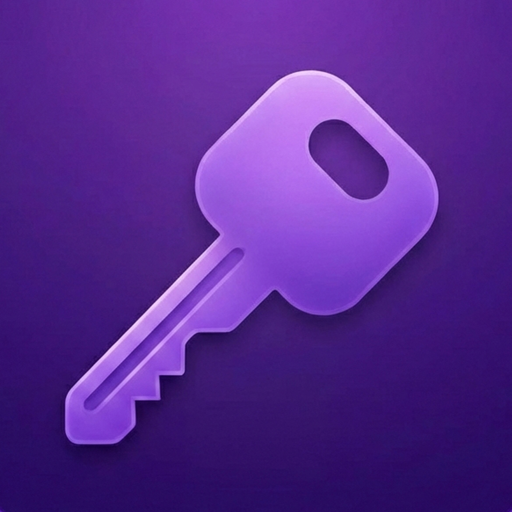

<p align="center">
  
</p>

<h1 align="center">PastePassword</h1>

<p align="center">
  <strong>A lightweight, local-only credential manager for developers.</strong>
</p>

<p align="center">
  <a href="https://github.com/NYTEMODEONLY/pastepassword/releases"></a>
  <a href="https://github.com/NYTEMODEONLY/pastepassword/actions/workflows/ci.yml"></a>
  <a href="LICENSE"></a>
  <a href="https://nytemode.com"></a>
</p>

<p align="center">
  <a href="#install">Install</a> &middot;
  <a href="#features">Features</a> &middot;
  <a href="#keyboard-shortcuts">Shortcuts</a> &middot;
  <a href="#security">Security</a> &middot;
  <a href="#build-from-source">Build</a>
</p>

---

## The Problem

You're a developer. You paste API keys, tokens, passwords, and secrets into Notes.app "just for a second." Weeks later, you have 200 lines of unlabeled credentials and no idea which project they belong to.

**PastePassword fixes this.** Paste a credential, it auto-detects the type, you tag it by project, and it's encrypted and searchable in seconds. No cloud. No account. No network requests. Ever.

---

## Features

### Quick Add &mdash; 3 clicks to save
Press `⌘N` from anywhere. PastePassword auto-reads your clipboard, detects the credential type, and lets you tag and save instantly.

### Instant Search
`⌘K` opens a Raycast-style search palette. Full-text search across all your credentials. Click a result to copy it to your clipboard.

### Auto-detect Credential Types
PastePassword recognizes what you paste and classifies it automatically:

| Type | Detected Patterns |
|---|---|
| **Password** | Strings with special characters |
| **API Key** | Stripe keys (`sk_live_`, `pk_test_`), AWS keys (`AKIA...`), hex/base64 strings |
| **Token** | JWTs, GitHub PATs (`ghp_`, `github_pat_`), Bearer tokens |
| **SSH Key** | PEM-formatted private keys (`-----BEGIN ... PRIVATE KEY-----`) |
| **Env Var** | `KEY=value` format |

### System Tray
Lives in your menubar. Quick Add, Search, and recent credentials accessible without switching windows. Global shortcuts work from any app.

### Auto-lock
Vault automatically locks after idle timeout (configurable: 1min to never). Clipboard auto-clears copied secrets after 30 seconds.

### Tags & Organization
Tag credentials by project, environment, service, or whatever makes sense. Filter by tag, type, favorites, or archived items from the sidebar.

### Import & Export
Back up your vault to JSON. Import it on another machine. Your data is yours.

### Zero Network
There is no network code in this app. The Content Security Policy blocks all requests. No telemetry, no analytics, no update checker, no cloud sync. Fully offline by design.

---

## Install

### Download

Download the latest release for your platform from [**GitHub Releases**](https://github.com/NYTEMODEONLY/pastepassword/releases).

| Platform | File | Architecture |
|---|---|---|
| macOS | `.dmg` | Apple Silicon (arm64) |
| macOS | `.dmg` | Intel (x64) |
| Windows | `.msi` | x64 |
| Linux | `.AppImage` / `.deb` | x64 |

### Homebrew (coming soon)

```bash
brew install --cask pastepassword
```

---

## Keyboard Shortcuts

### In-app

| Shortcut | Action |
|---|---|
| `⌘N` | Quick Add credential |
| `⌘K` | Search credentials |
| `j` / `k` | Navigate credential list |
| `Esc` | Close modal / deselect |

### Global (from any app)

| Shortcut | Action |
|---|---|
| `⌘⇧V` | Quick Add |
| `⌘⇧F` | Search |

---

## Security

PastePassword is built with a security-first architecture. Your secrets never leave your machine.

| Layer | Implementation |
|---|---|
| **Encryption** | AES-256-CBC via SQLCipher &mdash; entire database file encrypted |
| **Key Derivation** | Argon2id (64MB memory, 3 iterations, 4 parallelism) &mdash; OWASP recommended |
| **Memory Safety** | Rust backend with `zeroize` crate &mdash; secrets cleared from memory on drop |
| **Network** | Zero &mdash; CSP blocks all requests, no fetch/XHR/WebSocket |
| **Clipboard** | Auto-clears after 30 seconds |
| **List Views** | Secret values never loaded in list views &mdash; only on explicit view/copy |
| **Storage** | Single encrypted file in platform app data directory |

### How it works

```
Master Password
      |
      v
Argon2id(password, salt) --> 32-byte key
      |
      v
SQLCipher PRAGMA key --> AES-256 encrypted database
```

Your master password is never stored. A random 16-byte salt is generated on first setup and stored alongside the database. The derived key unlocks the SQLCipher database. If you forget your password, your data cannot be recovered.

---

## Tech Stack

| Component | Technology |
|---|---|
| Framework | [Tauri 2.0](https://tauri.app/) &mdash; Rust backend, ~8MB app |
| Frontend | React 19 + TypeScript |
| Database | SQLite + [SQLCipher](https://www.zetetic.net/sqlcipher/) |
| Styling | Tailwind CSS 4 + inline styles |
| Search | SQLite FTS5 (full-text search) |
| State | [Zustand](https://github.com/pmndrs/zustand) |
| Icons | [Lucide](https://lucide.dev/) |

---

## Build from Source

### Prerequisites

- [Rust](https://rustup.rs/) (stable)
- [Node.js](https://nodejs.org/) 22+
- [pnpm](https://pnpm.io/)
- macOS: Xcode Command Line Tools
- Linux: `libwebkit2gtk-4.1-dev libappindicator3-dev librsvg2-dev patchelf`

### Development

```bash
git clone https://github.com/NYTEMODEONLY/pastepassword.git
cd pastepassword
pnpm install
pnpm tauri dev
```

### Production Build

```bash
pnpm tauri build
```

The built app will be in `src-tauri/target/release/bundle/`.

---

## Project Structure

```
pastepassword/
├── src/                    # React frontend
│   ├── components/         # UI components
│   │   ├── auth/           # Setup & Unlock screens
│   │   ├── credentials/    # List, Detail, QuickAdd, Edit
│   │   ├── layout/         # Sidebar, MainLayout
│   │   ├── search/         # Search palette
│   │   └── settings/       # Settings panel
│   ├── stores/             # Zustand state management
│   ├── lib/                # Utilities, Tauri IPC wrappers, shared styles
│   └── types/              # TypeScript interfaces
├── src-tauri/              # Rust backend
│   └── src/
│       ├── commands/       # Tauri IPC command handlers
│       ├── crypto/         # Argon2id KDF, vault lock/unlock
│       ├── db/             # SQLCipher connection, migrations, models
│       └── detection/      # Regex-based credential type detection
├── .github/workflows/      # CI + Release automation
└── README.md
```

---

## Contributing

Contributions are welcome! Please see [CONTRIBUTING.md](CONTRIBUTING.md) for guidelines.

---

## License

[MIT](LICENSE)

---

<p align="center">
  A <a href="https://nytemode.com">nytemode</a> project
</p>
